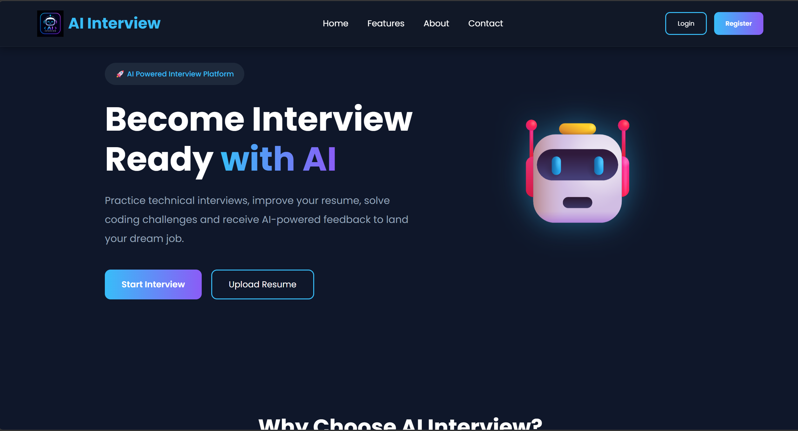
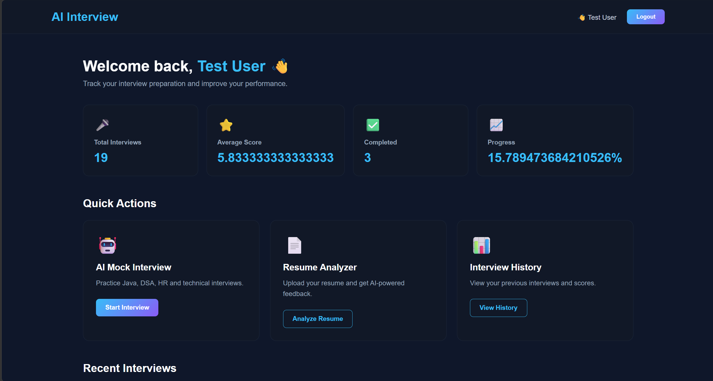
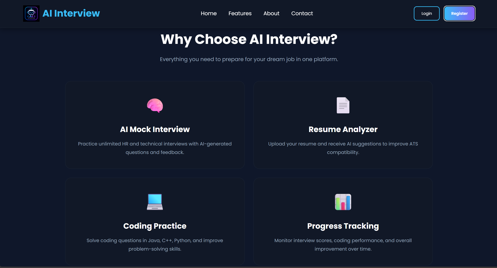
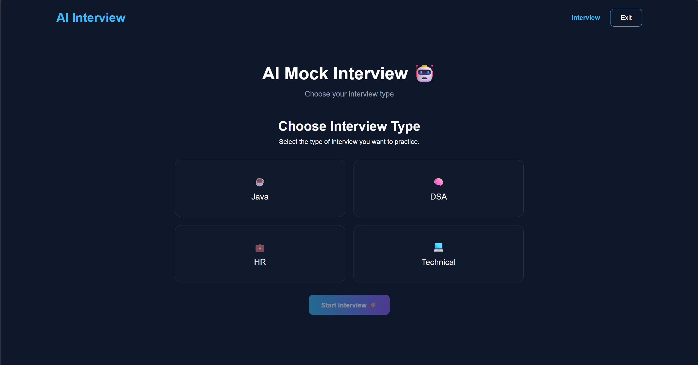
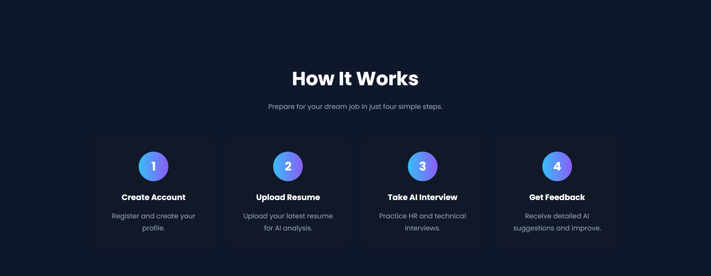

# 🤖 AI Interview Preparation Platform

An AI-powered full-stack web application designed to help users practice technical interviews, answer AI-generated questions, and receive automated feedback on their answers.

The platform combines a Java Spring Boot backend, MySQL database, JavaScript frontend, JWT authentication, and a locally running Ollama AI model.

---

## 🚀 Features

### 🔐 User Authentication
- User registration and login
- Password hashing using BCrypt
- JWT-based authentication
- Remember Me functionality
- Protected application flow

### 🎯 AI Interview Practice
- Start a new interview
- Select interview type
- Generate interview questions using AI
- Five-question interview flow
- Submit answers for evaluation

### 🤖 AI-Powered Evaluation
- Local AI integration using Ollama
- AI evaluates user answers
- Score generated on a 10-point scale
- Personalized feedback for each answer

### 📊 Results & Performance
- Overall interview score
- Individual question scores
- Performance classification
- Interview summary
- Detailed feedback

### 📚 Interview History
- View previous interviews
- Interview date and time
- Interview ID
- Completed interview results

### 📈 Dashboard
- Total interviews
- Completed interviews
- Average score
- Progress overview

### 🎨 Responsive Frontend
- Modern dark-themed UI
- Responsive design
- Login and registration validation
- Custom AI Interview branding
- Logo and favicon

---

## 🛠️ Tech Stack

### Frontend
- HTML5
- CSS3
- JavaScript

### Backend
- Java
- Spring Boot
- Spring Security
- Spring Data JPA
- REST APIs
- Maven

### Database
- MySQL

### Authentication
- JWT
- BCrypt Password Hashing

### AI
- Ollama
- Qwen3 8B

---

## 🏗️ System Architecture

```text
                    ┌─────────────────────┐
                    │     User / Browser  │
                    └──────────┬──────────┘
                               │
                               ▼
                    ┌─────────────────────┐
                    │   HTML / CSS / JS   │
                    │      Frontend       │
                    └──────────┬──────────┘
                               │
                         REST API Calls
                               │
                               ▼
                    ┌─────────────────────┐
                    │     Spring Boot     │
                    │       Backend       │
                    └──────┬────────┬─────┘
                           │        │
                  ┌────────┘        └─────────┐
                  ▼                           ▼
        ┌─────────────────┐          ┌─────────────────┐
        │      MySQL      │          │     Ollama      │
        │    Database     │          │   Qwen3 8B AI   │
        └─────────────────┘          └─────────────────┘
```

---

## 📂 Project Structure

```text
AI-Interview-Preparation-Platform/
│
├── Backend/
│   └── ai-interview-backend/
│       ├── src/
│       │   ├── main/
│       │   │   ├── java/
│       │   │   │   └── com/nishant/aiinterview/
│       │   │   │       ├── config/
│       │   │   │       ├── controller/
│       │   │   │       ├── dto/
│       │   │   │       ├── entity/
│       │   │   │       ├── exception/
│       │   │   │       ├── repository/
│       │   │   │       ├── security/
│       │   │   │       └── service/
│       │   │   └── resources/
│       │   └── test/
│       ├── pom.xml
│       └── test.http
│
├── Frontend/
│   ├── html/
│   ├── css/
│   ├── js/
│   └── assets/
│
├── Screenshots/
│
├── .gitignore
└── readme.md
```

---

## 🔄 Application Workflow

```text
Landing Page
      ↓
Login / Registration
      ↓
JWT Authentication
      ↓
Dashboard
      ↓
Start Interview
      ↓
Select Interview Type
      ↓
AI Generates Questions
      ↓
User Answers Questions
      ↓
AI Evaluates Answers
      ↓
Score + Feedback
      ↓
Interview Results
      ↓
Interview History
```

---

## 🔐 Authentication Flow

The application uses JWT-based authentication.

```text
User Login
    ↓
Spring Boot Authentication
    ↓
Credentials Verified
    ↓
JWT Token Generated
    ↓
Token Stored by Frontend
    ↓
Token Sent with Protected Requests
    ↓
JWT Filter Validates Token
    ↓
Protected API Access
```

Passwords are stored using BCrypt hashing rather than storing plain-text passwords.

---

## 🤖 AI Integration

The platform uses a locally running Ollama model for AI functionality.

```text
Spring Boot
     │
     ▼
Ollama API
     │
     ▼
Qwen3 8B
     │
     ├── Generate Interview Questions
     │
     └── Evaluate User Answers
```

Running the AI locally keeps the interview generation and evaluation workflow independent of external AI APIs.

---

## 🗄️ Database

MySQL is used for persistent application data.

The backend uses:

- Spring Data JPA
- Hibernate
- MySQL
- Entity relationships
- Repository-based data access

The application stores information related to:

- Users
- Interviews
- Questions
- Answers

---

## ▶️ How to Run

### 1. Clone the repository

```bash
git clone https://github.com/nishant-dhruw/Ai-interview-preparation-platform.git
```

### 2. Configure MySQL

Create a MySQL database:

```sql
CREATE DATABASE ai_interview_db;
```

Configure the database credentials using environment variables.

Example:

```properties
spring.datasource.url=jdbc:mysql://localhost:3306/ai_interview_db
spring.datasource.username=root
spring.datasource.password=${DB_PASSWORD}
```

> ⚠️ Never commit real database passwords, API keys, JWT secrets, or other credentials to GitHub.

### 3. Install and run Ollama

Make sure Ollama is running locally and the required model is available.

```bash
ollama run qwen3:8b
```

### 4. Start the Spring Boot backend

Navigate to:

```text
Backend/ai-interview-backend
```

Then run:

```bash
mvnw spring-boot:run
```

The backend runs on:

```text
http://localhost:8080
```

### 5. Run the frontend

Open:

```text
Frontend/html/index.html
```

using a local development server such as the VS Code Live Server extension.

---

## 📸 Screenshots

### Landing Page



### Login


### Dashboard



### Application



### Testing



### User Page


### Bottom Section



---

## 🔮 Future Enhancements

Planned improvements include:

- 📄 Resume analysis
- 🎤 Voice-based interview interaction
- 🧠 More advanced AI feedback
- 📊 Detailed progress analytics
- 🏆 Interview performance tracking
- ☁️ Cloud deployment
- 📱 Further mobile responsiveness
- 🎯 More interview categories and difficulty levels

---

## 👨‍💻 Author

**Nishant Kumar Dhruw**

Computer Science / Software Development Enthusiast

Interested in:

- Java
- Spring Boot
- Full-Stack Development
- Artificial Intelligence
- Machine Learning
- Data Structures & Algorithms

---

## ⭐ Project Status

🚧 **Active Development**

The core interview, authentication, AI question generation, answer evaluation, results, dashboard, and history functionality has been implemented.

---

## 📄 License

This project is created for learning, development, and portfolio purposes.
